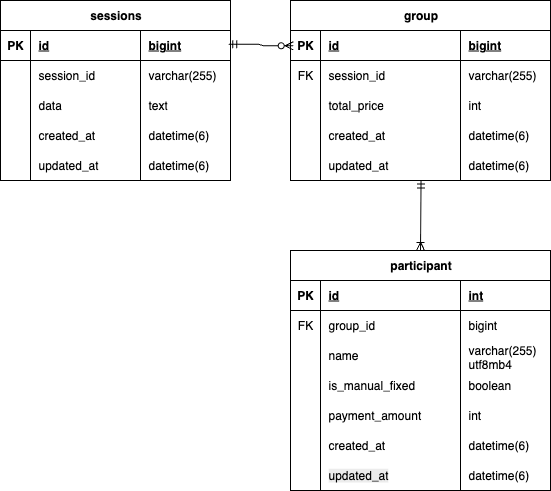

# サービス名
Compatch(コンパッチ)

飲み会やコンパの問題を解決したいという意図からCompa+Patchを組み合わせたサービス名にしました。

---

## 概要
Compatchは飲み会やコンパにおける、幹事の為の割り勘・集金サービスです。
参加者の不満を残さず、円満にイベント毎を開催するためのサポートを行うサービスです。

---

## プロダクトURL
<https://compatch.net/>

---
## サービスを開発したきっかけ

---

## 画面イメージ

---

## サービス機能一覧
 - 
 - 

---

## 工夫やこだわった点
 - 
 - 

---

## 今後の課題や機能追加について
 - 
 - 

---

## 技術スタック

---

## ER図

---

## インフラ構成図

---

## 業務フロー図

