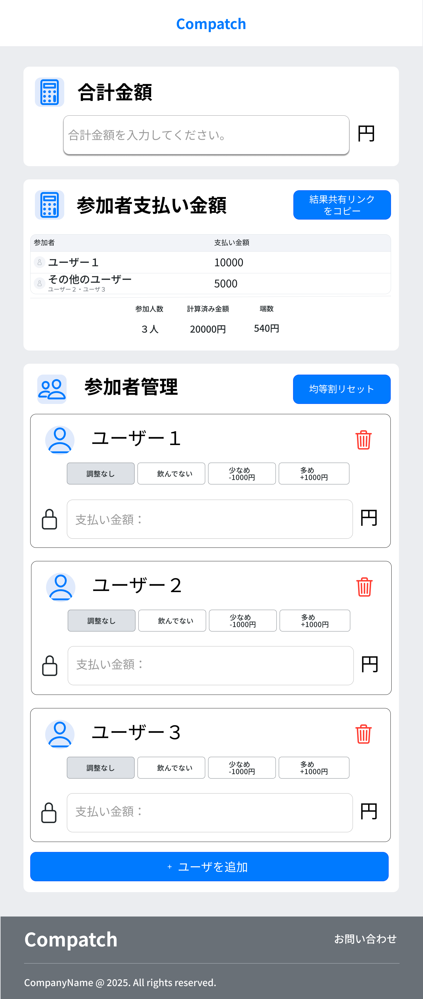

# 🏷️サービス名
**Compatch(コンパッチ)**

飲み会やコンパの問題を解決したいという意図からCompa+Patchを組み合わせたサービス名にしました。

---

## 💡概要
Compatchは飲み会やコンパにおける、幹事の為の割り勘・集金サービスです。
参加者の不満を残さず、円満にイベント毎を開催することを目的としています。

---

## 🔗プロダクトURL
<https://compatch.net/>

---
## 🎯サービスを開発したきっかけ
飲み会の幹事を務めた際、合計金額を人数で均等に割って徴収したところ、お酒を飲まない参加者から「あの調整、どうなっているの？」と後日、個別に相談を受けました。

この経験から、**割り勘の不公平さが人間関係の気まずさを生む**ことを痛感しました。
また、**特定の参加者を考慮した複雑な割り勘は、手計算では非常に困難な課題**であると認識しました。

特に、**公平な割り勘を実現するために必要な厳密な計算と、酔いによる認知能力の低下は両立しません。** そこで、この課題を解決する本サービス「Compatch（コンパッチ）」の開発に至りました。

---

## 🖼️画面イメージ
- 初期画面
    

- グループ作成・管理画面
    

- 計算画面
    

- 結果共有画面
    
---

## ✨サービス機能一覧
- **ログイン不要・即時利用**: 面倒なアカウント登録は不要です。**セッションによる簡易認証**を採用することで、URLアクセス後すぐに計算を開始でき、計算までの操作を最小限にします。
- **柔軟な割り勘調整機能**: 特定の参加者（例: 飲酒者）の支払い金額を固定・調整することで、残りのメンバーの金額を瞬時に自動で再計算します。
- **集金効率の向上機能**: 支払い金額を**きりの良い数字**に自動で調整し、小銭のやり取りを不要にします。
- **イベント・メンバーの登録・管理**: 飲み会ごとに必要な情報（総額、メンバー）を一元管理します。

---

## ⚙️工夫やこだわった点
- **現場の負担をゼロにするUI/UX設計**
  - **ログインを不要**（セッション認証採用）とし、URLアクセス後すぐに計算を開始できる即時性を実現しました。
  - **計算処理を自動化**し、**支払い金額をきりの良い数字に自動で割り振る**ことで、小銭のやり取りと集計時のストレスを排除しました。
- **不公平感を残さない柔軟な計算ロジック**
  - 参加者の飲酒量や滞在時間などに基づき、**特定のメンバーの支払い金額を固定・調整**できる機能を実装しました。これにより、誰にも不満を残さない、公平性の高い割り勘を可能にしました。
- **拡張性と保守性を高めるモジュール設計**
  - 割り勘計算処理を独立した**モジュールとして抽象化**し、外部から設定値（例：切り上げ単位、固定額）を渡すことで、**計算ロジックを柔軟に変更できる**構造としました。
  - この設計は、今後の**グループごとのカスタム設定機能**など、**将来的な機能追加と長期的な保守性**を考慮したものです。

---

## 📈今後の課題や機能追加について
- **柔軟なカスタマイズ機能の追加**: 現在、金額調整ボタン（+1000・-1000）や自動計算時の切り上げ（500円単位）が固定化されているため、**グループやイベントごとに自由に設定をカスタマイズできる機能**の追加。
 - **外部決済連携**: QRコード決済やクレジットカード決済など、外部決済サービスとの連携を行い、集金プロセスを完全にオンライン化することで、現金のやり取りを不要にする。

---

## 🛠️技術スタック

| カテゴリ | 使用技術 | バージョン | 詳細 |
| :--- | :--- | :--- | :--- |
| **フロントエンド** | Turbo(Hotwire) | v2.0.16 | 計算結果の動的更新、画面からのリクエスト処理に活用 |
|  | Stimulus | v1.3.4 | |
| **バックエンド** | Ruby on Rails | v8.0.2 | 主要なビジネスロジックを実装 |
| **データベース** | MySQL | v8.4.4 | グループ・計算結果データ管理 |
| **サーバー** | nginx, puma | - | Webサーバーとしてnginx、Appサーバーとしてpumaを使用 |
| **インフラ** | AWS (EC2, S3, ALB) | - | 本番環境のデプロイ、デプロイ用ファイル管理 |
| **デプロイ** | GitHub Actions | - | CI/CDの自動化 |
| **テスト** | RSpec | v3.13.1 | モデル・ビジネスロジックの単体テストを実施 |
---

## 🗃️ER図

---

## ☁️インフラ構成図

---

## 🔄業務フロー図

